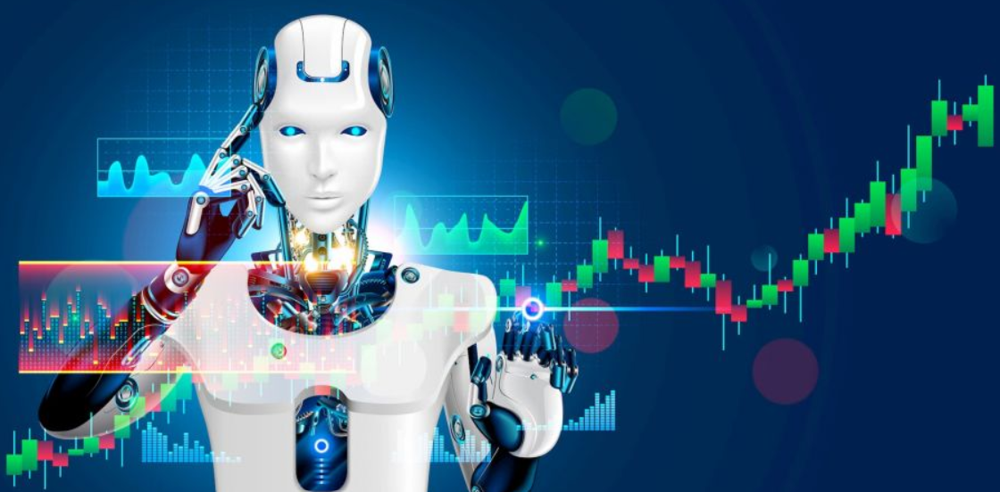
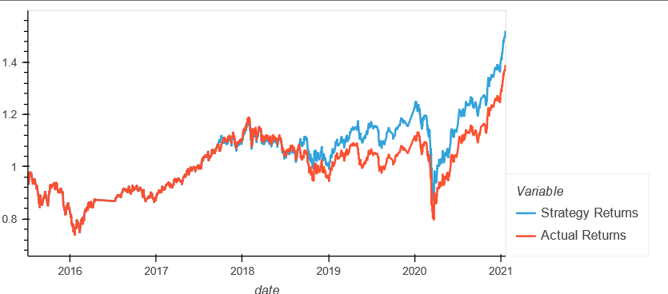
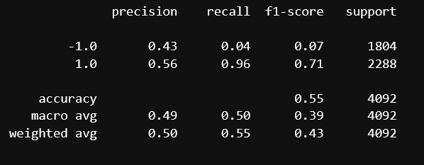
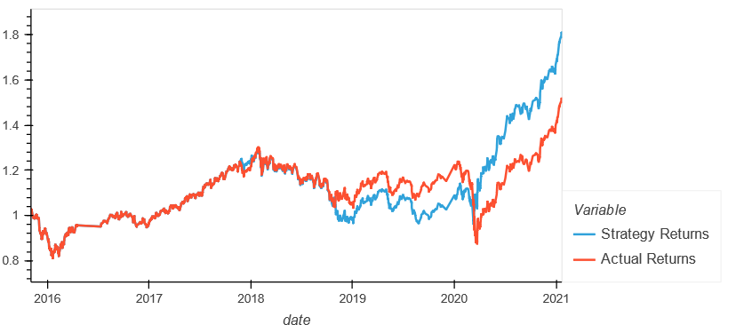
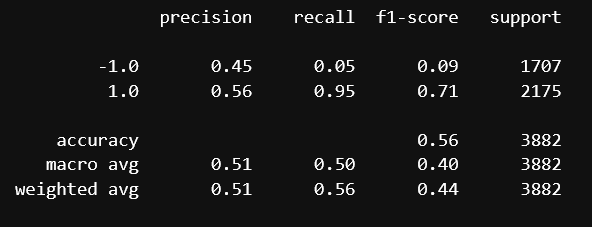
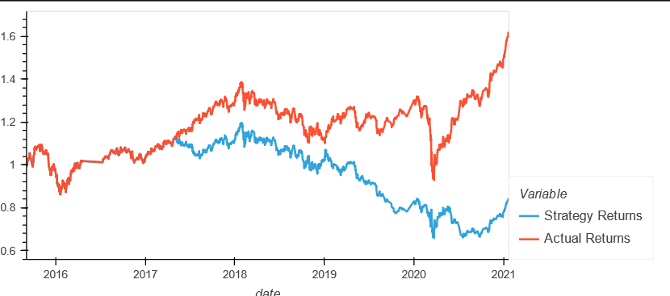
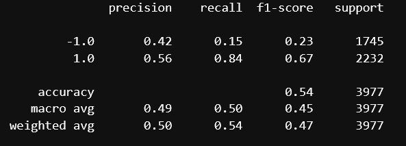

# **Fintech Bootcamp Challenge 14**
## AI Algorithmic trading bot

---


---
Algorithmic trading bot that learns and adapts to new data and evolving markets. Created an algo trading bot using financial python code and machine learning libraries. 


 - Implemented an algorithmic trading strategy that uses machine learning to automate trade decisions

 - Adjusted the input parameters to optimize the trading algorithm

 - Trained a new machine learning model and compared its performance to that of a baseline model
 
 ---
 ## **Technology**
 ---
 
 ### Technology used:
 
 - Python 3.7
 - Python Code
 - Jupyter Labs (.ipynb notebook file)
 
 Python Libraries:
 
 - pandas
 - numpy
 - hvplot.pandas
 - sklearn
 - pathlib
 - DateOffset
 ---

## **Installation Guide**

---

Before running the application first install the following dependencies:
 
 ```python 
     pip install pandas
     pip install numpy
     pip install hvplot
     pip install pathlib
     pip install sklearn
  ```
  ---
  
  # **Summary**
  
  ### *Baseline/Orignal Test Data*:
  
  
  
  
  The above report table and chart show the baseline or original results of the developed AI trading model. In the chart we can see that in the second half of the period the strategy developed by the AI model outperformed the Actual Retutrns. However the Accuracy and Precision metrics in the report, as well as other metrics, are not high enough to have much confidence in the model developed here. 

---
  ### *Adjusting the size of the training dataset*:



The original/baseline model used 3 months worth of data for the training dataset. For the second model, we adjusted the training dataset to include 7 months of data instead of 3. The report table shows a very slight improvement in its accuracy and precision numbers, but not significant. However, the Strategy returns have increased significantly compared to the Actual returns for the whole period, with an underperfomance between 2019 and 2020 as seen in the chart. Overall, we can conclude that the adjustment has imporved the Machine learning model.

---

  ### *Adjusting the SMA input features*:
  



The orignal model used two SMAs: 100 day Slow SMA and 4 day Fast SMA for signals. In this test we adjusted the Fast SMA to 7 Days and the Slow SMA to 80 Days. The results of the AI model test showed that the Accuracy and Precision decreased and that the Strategy cumulative returns were much lower than the Actual returns, which was not the case with the previous tuned test. From this, we can conclude that the SMA adjustments diminshed the results and worsened the model perfomance overall. 
 
---

### **Contributors**

- Gorovodskiy, Herman (ggorovod01@gmail.com) 


### **License**
---

MIT